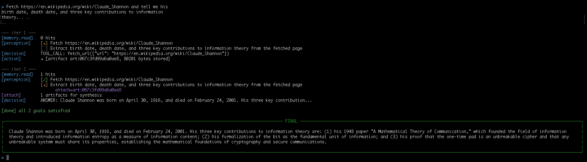
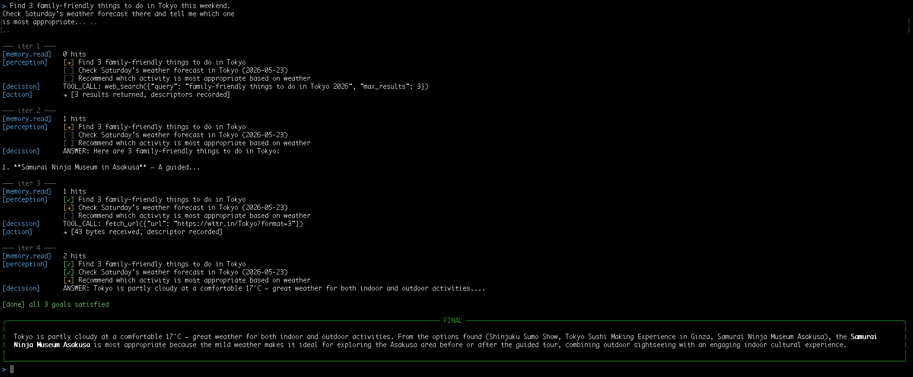
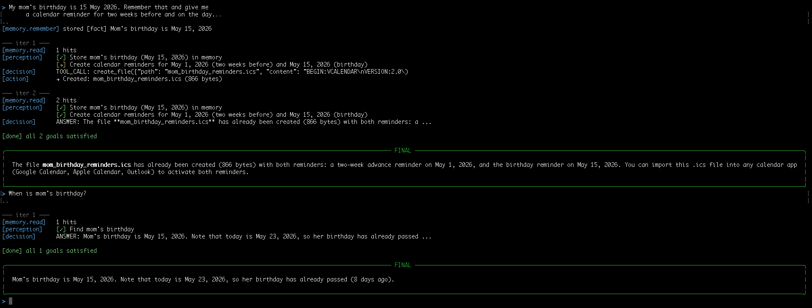
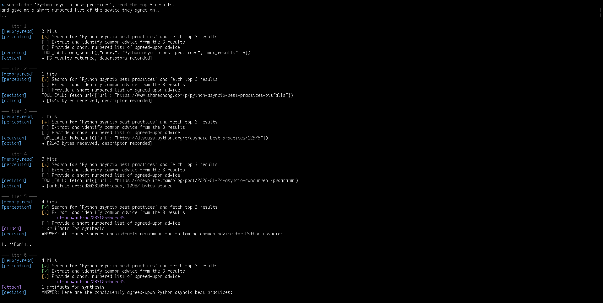
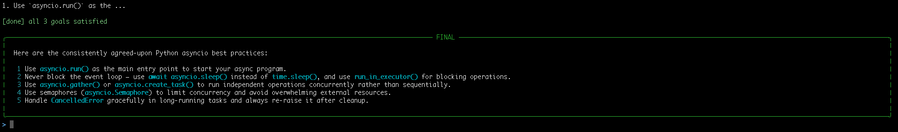

# Agent6 — Four-Role Agentic Architecture

A production-hardened AI agent built on typed cognitive roles, persistent memory, and multi-provider LLM routing.

## Architecture

```
┌─────────────────────────────────────────────────────────────┐
│                        AGENT LOOP                           │
│                                                             │
│  ┌──────────┐   ┌────────────┐   ┌──────────┐   ┌───────┐   │
│  │  Memory  │──▶│ Perception │──▶│ Decision │──▶│Action │   │
│  │          │   │            │   │          │   │       │   │
│  │ read()   │   │ observe()  │   │next_step()│  │execute│   │
│  │ remember │   │ → Goals[]  │   │→ Answer  │   │→ MCP  │   │
│  │ record() │   │ → Done?    │   │→ ToolCall│   │       │   │
│  └──────────┘   └────────────┘   └──────────┘   └───────┘   │
│       │                                              │      │
│       └──────────── record_outcome ◀─────────────────┘      │
│                                                             │
│  Substrate: LLM Gateway V3 (Bedrock / NVIDIA / Gemini)      │
│  Transport: MCP over stdio                                  │
│  Contracts: Pydantic v2 on every boundary                   │
└─────────────────────────────────────────────────────────────┘
```

### The Four Roles


| Role           | File            | Responsibility                                                    | LLM Call?               |
| -------------- | --------------- | ----------------------------------------------------------------- | ----------------------- |
| **Memory**     | `memory.py`     | Persist facts, preferences, tool outcomes. Keyword-search reads.  | Yes (classify on write) |
| **Perception** | `perception.py` | Decompose query into goals, track completion, decide attachments. | Yes (structured output) |
| **Decision**   | `decision.py`   | Pick next action for one goal: answer OR one tool call.           | Yes (tool-calling)      |
| **Action**     | `action.py`     | Dispatch MCP tool, threshold artifacts, guard handles.            | No                      |


### Supporting Components


| File                     | Purpose                                                                  |
| ------------------------ | ------------------------------------------------------------------------ |
| `schemas.py`             | Pydantic models: MemoryItem, Goal, Observation, ToolCall, DecisionOutput |
| `llm_gateway/gateway.py` | Multi-provider router with retry/backoff (Bedrock, NVIDIA, Gemini)       |
| `artifacts.py`           | Content-addressable store for large tool outputs (>4KB)                  |
| `config.py`              | Centralized settings via pydantic-settings                               |
| `mcp_server.py`          | 9 tools: web_search, fetch_url, get_time, currency_convert, file ops     |
| `chat.py`                | Interactive CLI REPL (like Claude Code)                                  |
| `chatbot.py`             | Web UI with WebSocket streaming                                          |


## Setup

```bash
# Install dependencies
uv sync

# Configure (copy and fill in)
cp .env.example .env

# For AWS Bedrock (recommended — no rate limits):
# Ensure `aws configure --profile bedrock` is set up

# Run interactive chat
uv run python chat.py

# Run single query
uv run python agent6.py "What time is it?"

# Run web chatbot
uv run python chatbot.py
# → Open http://localhost:8000

# Run tests
uv sync --extra dev
uv run pytest tests/ -v
```

## Target Queries (actual terminal output)

> The following is captured from `uv run python chat.py` on a clean state.

### Query A — Wikipedia Fetch + Extraction



### Query B — Multi-Goal + Weather Constraint



### Query C — Durable Memory Across Runs



### Query D — Multi-Source Synthesis





## Key Design Decisions

- **Typed boundaries**: Every role consumes/produces Pydantic models. No free-form dicts between roles.
- **Artifact store**: Tool results >4KB go to content-addressable storage. Memory holds only the handle.
- **Sticky-done**: Once Perception marks a goal done, it stays done forever.
- **Force-answer on synthesis**: When prior results exist and goal is synthesis, tools are disabled — model must answer from memory.
- **Multi-fetch enforcement**: "Read top N results" goals require N distinct fetch_url calls before marking done.
- **Readability extraction**: Uses `readability-lxml` (Firefox Reader View algorithm) for clean web content.


